# 实验15：2022年秋季学期《计算机网络实验》期末综合设计

    这是这学期《计算机网络实验》的大作业。根据津宝的意思，之后几届的计网期末实验都差不多，所以也许这份文档还挺有用的。
    由于计算机网络的实验都是在Packet Tracer中仿真的，所以我们完成这个作业时，按照乙方解决甲方需求的步骤来完成就很合适。

## 一、目录

* [分析需求](#二分析需求)
  * [所需求的功能](#1-所需求的功能)
  * [拓扑图](#2-拓扑图)
  * [可行性分析](#3-可行性分析)
* [搭建网络拓扑与一些前期准备](#三搭建网络拓扑与一些前期准备)
  * [一些技巧与注意点](#1-一些技巧与注意点)
  * [硬件选型](#2-硬件选型)
  * [拓扑搭建结果](#3-拓扑搭建结果)
  * [子网规划](#4-子网规划)
* [基本需求配置](#四基本需求配置)
  * [划分子网与配置VLAN](#1-划分子网与配置vlan)
  * [配置相关IP地址](#2-配置相关ip地址)
  * [链路捆绑与生成树协议](#3-链路捆绑与生成树协议)
  * [OSPF](#4-ospf)
  * [NAT与静态路由](#5-nat与静态路由)
  * [校园网、DNS、邮箱服务](#6-校园网dns邮箱服务)
  * [配置无线网络](#7-配置无线网络)
  * [VPN配置](#8-vpn配置)
  * [配置额外的ACL访问控制](#9-配置额外的acl访问控制)
* [附加需求配置](#五附加需求配置)
  * [Extra 1: IP电话](#extra-1-ip电话)
  * [Extra 2: 防火墙](#extra-2防火墙)
* [References](#六references)

## 二、分析需求

    任何领域工程问题的乙方，接手一个项目的第一件事就是确定甲方需求。现在甲方就是老师，而且给了拓扑图，直接就省去了沟通成本。
> 首先，非常建议你仔细读一下[原需求文档](./计算机网络实验-期末考核要求.pdf)，先做到对各项功能有点数

### 1. 所需求的功能

    功能要求包括10个必做功能和2个选做功能。

1. 划分子网：理解，为了便于分区管理。
2. 划分VLAN：emmm，应该也是便于分区管理。
3. OSPF路由配置和静态路由配置：让部分设备使用OSPF算法进行路由，其实就是给重要的设备分配更好的网络环境
4. WiFi网络配置：都2203年了，无线网络已经几乎必不可少了
5. NAT外网访问：校园网作为一个大LAN，校内用的是局域网IP，在出口路由处要映射为外网IP，这很合理。
6. VPN外网访问：其实YNU就有VPN服务，比如在校外用学校图书馆的身份访问知网。
7. 路由器双机热备HSRP：校园网这种规模的网络，核心功能由两台核心设备承担，这很合理。（如果有负载均衡就更合理了）
8. 最小生成树STP：用以保证网络无环路存在。
9. ACL访问控制：类比一下，明远楼的电脑不接入校园网肯定不太方便，而接入之后由于许多学校的内部资料不便外传，所以需要ACL限制访问权限。
10. HTTP、DNS和邮件服务器配置：都2203年了，访问网站肯定用的是域名啊，所以DNS和HTTP服务是必不可少的。邮件服务器嘛....教育邮箱还是用处不小的（嫖各种软件的学生版/教育版）
11. IP电话：用IP网线代替电话线，也就是内线电话Pro版。在本实验中有一点麻烦，可以不搞。
12. 内外网防火墙：CN玩家应该非常熟悉这玩意。在本实验中很简单，比较建议搞一下。

### 2. 拓扑图

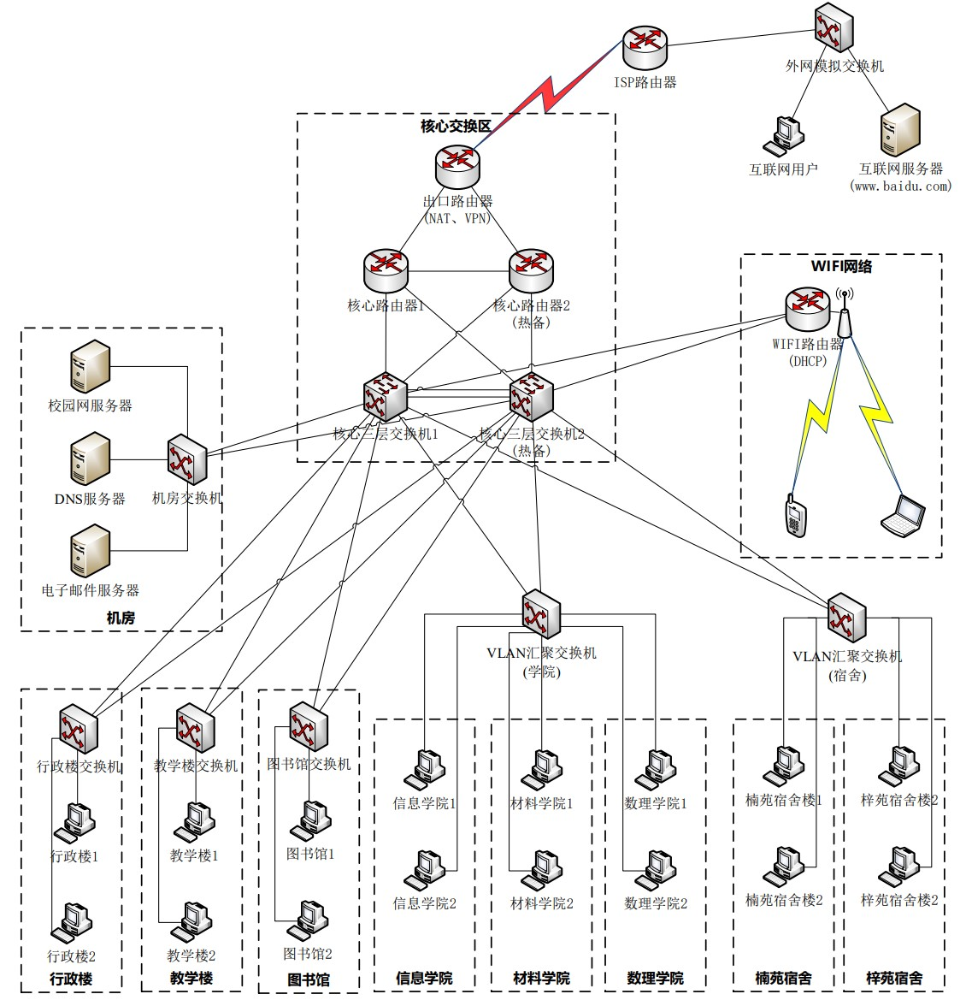

* 这幅图是很完善的，已经十分熟悉Packet Tracer的同学应该能看出来，这幅图的每个设备几乎都可以无缝迁移到Packet Tracer的网络拓扑中。
* 似乎下一步就可以直接Packet Tracer搭建网络了？先别急，还有一步。

### 3. 可行性分析

      看完需求文档应该有一点印象：整个校园网的主机数、子网数都不少，而分配的网段又很有限。是的，本题中很重要的一点是你的网段并不充裕，只是刚好够用。所以强烈建议你规划IP时一定！一定要省着点用，我就是吃了这个的大亏....
> 此时的可行性分析主要就是考虑一下这个网段进行子网划分究竟够不够，能剩多少的事情。因为划分子网时IP是要向上膨胀的，所以这个要好好计算一下。

* `172.16.0.0/20`的网段，有$2^{32-20}=2^{12}=4096$个IP

| 区域 | 所需主机数 | 最小子网IP数 |
|:----:|:----:|:----:|
| 行政区 | 200 | 256 |
| 信息学院 | 500 | 512 |
| 材料学院 | 200 | 256 |
| 数统学院 | 200 | 256 |
| 宿舍区 | 1700($850\times 2$) | 2048($1024\times 2$) |
| 教学楼 | 100 | 128 |
| 图书馆 | 200 | 256 |
| 机房 | 100 | 128 |
| 合计 | 3000 | 3840 |

* 目前看来内网还能剩下256个空闲IP，但这些IP还将用于内网各个路由器之间通信、划分给无线路由等。分析结果是可行，但也只是将将够用，所以在前期VLAN划分时，一定要注意IP省着点用。

## 三、搭建网络拓扑与一些前期准备

    分析的差不多了，我们就正式着手搭建吧。

### 1. 一些技巧与注意点

* 首先，强烈建议不要用自动连接，而是手动连接，连接时请尽量保持接口连接有序，对称设备（比如两台相互热备的交换机）各接口连接的设备相同或对称。这么做是为了方便之后的配置。
* (英文输入法下)按下`N`键即可在拓扑任意位置添加备注，记得多用这功能，可以方便你确定各接口的IP地址等
* 在`Options-Preferences(选项-参数选择)`中勾选`Show Device Name Labels(显示设备名称标签)`和`Always Show Port Labels in Logical Workspace(在逻辑工作空间中总显示端口标签)`，这将方便你之后的配置
* 此外，建议将硬件的hostname自定义一下，当然不自定义的话对配置并没有影响，顶多是窗口开的多了有点晕而已。

### 2. 硬件选型

> 其实单从性能来说，本题中硬件选型并没有什么要求，一般选的都能满足需求。主要是有些设备需要自己添加模块。

* 路由器：全部选择`2811`路由器即可。
  * 对于两个**核心路由器**，需要添加`NM-2FE2W`模块，以扩展FastEthernet端口数量。
  * 对于提供WiFi路由服务的路由器，需要添加`NM-2FE2W`模块，以扩展FastEthernet端口数量。
  * 对于**出口路由器**和**ISP路由器**，需要添加`HWIC-2T`模块，以扩展Serial串口数量。
* 交换机：全部选择`2960`交换机即可。
* 三层交换机：全部选择`3560-24PS`三层交换机即可。
* 无线路由器：选用`WRT300N`即可。
* 服务器：全部选择`Server-PT`即可
* 电脑：根据需求选择`PC`或`Laptop`即可。
  * WiFi处的笔记本电脑本身不带有无线模块。需要先将机身左侧的模块移除，并添加`WPC300N`模块，以使用无线网络。
* 连线：大多数使用`铜直通线(第3个选项)`或`铜交叉线(第4个选项)`即可，但在**出口路由器**和**ISP路由器**之间的连接需要使用`串行DCE线(第8个选项)`连接两个Serial端口。

### 3. 拓扑搭建结果

> 为便于查看，在截图中省掉了端口标签，想详细查看各端口的情况，可以直接查看pkt源文件

#### (1) 基础功能所需的网络拓扑

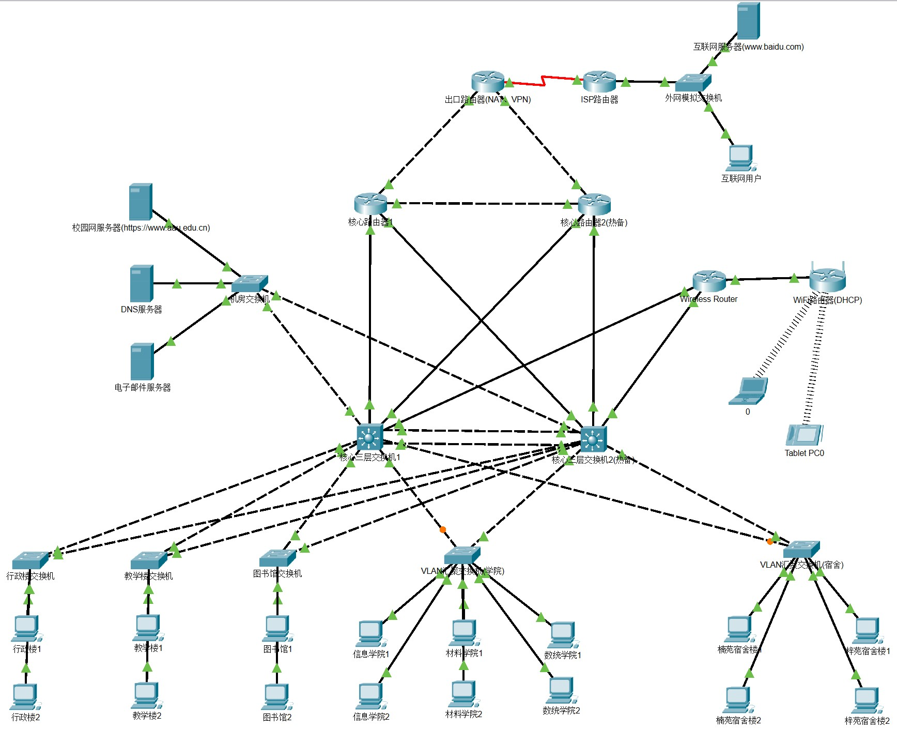

#### (2) 如果还想完成两个附加功能，则需要配置网络拓扑到这个程度

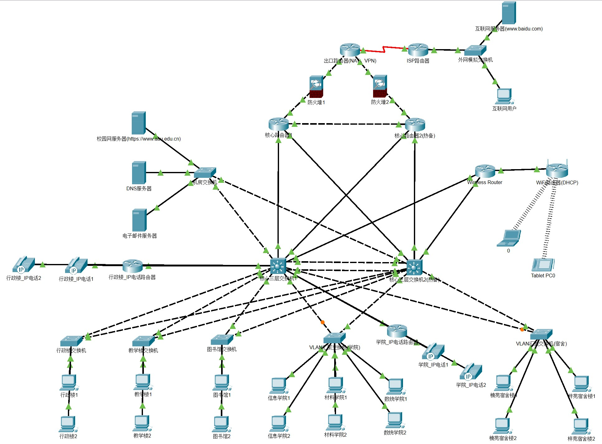

### 4. 子网规划

    这是非常重要的一步，尤其是对于这个题IP网段不充裕的情况。如果这里不好好规划，后面经常要一堆一堆地改IP，会非常麻烦。
> 我的VLAN划分如下表所示，这只是一种可行解，你的VLAN大可以按照自己的顺序来，但通常来说，子网的划分次序建议按照主机数降序。

  |  区域  | 主机数 | VLAN号 |    子网网段    | IP地址范围 |
  | :----: | :---: | :----: | :------------: | :-----------------------:|
  |  机房  |  100  | VLAN10 | 172.16.14.0/25 | 172.16.14.1-172.16.14.126 |
  | 行政楼 |  200  | VLAN20 | 172.16.13.0/24 | 172.16.13.1-172.16.13.254 |
  | 教学楼 |  100  | VLAN30 | 172.16.14.128/25 | 172.16.14.129-172.14.254 |
  | 图书馆 |  200  | VLAN40 | 172.16.12.0/24 | 172.16.12.1-172.16.12.254 |
  | 信息学院 |  500   | VLAN50 | 172.16.8.0/23  |  172.16.8.1-172.16.9.254  |
  | 材料学院 |  200   | VLAN60 | 172.16.10.0/24 | 172.16.10.1-172.16.10.254 |
  | 数统学院 |  200   | VLAN70 | 172.16.11.0/24 | 172.16.11.1-172.16.11.254 |
  | 楠苑宿舍 |  850  | VLAN80 | 172.16.0.0/22  | 172.16.0.1-172.16.3.254   |
  | 梓苑宿舍 |  850  | VLAN90 | 172.16.4.0/22  | 172.16.4.1-172.16.7.254   |
> 乍一看似乎VLAN分配的没什么规律....其实是有规律的，VLAN号是整个拓扑中，从机房区域逆时针分配的。当然VLAN号只是个名字，你的VLAN序号和主机数一一对应也可以。

## 四、基本需求配置

    配置大多采用指令完成(因为GUI只能完成部分相对较简单的配置)，对于少部分使用GUI的会额外截图展示。
    关于物理端口的连接方式，我没有在本文档的附图中展示，详情请到源文件中查看。
    在本Markdown中，命令的高亮和注释格式都借用了Matlab语法，以便于查看。但这不便于直接复制粘贴进行配置。你可以使用正则表达式删除命令中无用的部分，以下是一种可用的规则。
> 以下这两条规则可能会将Markdown正文中的部分内容删除，所以请只将其用于命令中。

* `[A-Z]{1}([A-Za-z0-9])+(\(([A-Za-z\-])+\))?[#>]{1}` :用以删除设备名和菜单页名
* `% ?.*` :用以删除文中Matlab风格的注释

### 1. 划分子网与配置VLAN

> 该步骤完成实验中的功能1和2

#### (1) 一些相关知识

* 三层交换机作为核心设备，需要定义并知晓所有的VLAN，而其下层的一般交换机仅起到转发作用，所以只需知晓自己域内的VLAN即可。
* 我们有进行双机热备，即让两个三层交换机共同分担压力，这是一种比较少见的配置情况，我们要在两台三层交换机上都配置VLAN10-VLAN90，且两台三层交换机为同一VLAN提供的VLAN网关要保持不同。
* 交换机的端口有两种协议：`trunk`和`access`。不讲原理，简单来说，对于“交换机-交换机”之间的接口，用`trunk`协议，对于“交换机-主机”之间的接口，用`access`协议

#### (2) 一些相关设计/约定

* 让核心交换机1作为VLAN10、VLAN20、VLAN30、VLAN40的默认交换机；让核心交换机2作为VLAN50、VLAN60、VLAN70、VLAN80、VLAN90的默认交换机，平衡负载。
* 每个VLAN网段中，`X.X.X.1`或`X.X.X.129`都是核心交换机1提供的VLAN网关；`X.X.X.2`或`X.X.X.130`都是核心交换机2提供的VLAN网关
* 也因此，本项目里主机的IP几乎都是从`X.X.X.3`开始的

#### (3) 指令

* 核心三层交换机1创建VLAN：

  ```Matlab
  SwitchCore1#conf t
  SwitchCore1(config)#vlan 10
  SwitchCore1(config-vlan)#vlan 20
  SwitchCore1(config-vlan)#vlan 30
  SwitchCore1(config-vlan)#vlan 40
  SwitchCore1(config-vlan)#vlan 50
  SwitchCore1(config-vlan)#vlan 60
  SwitchCore1(config-vlan)#vlan 70
  SwitchCore1(config-vlan)#vlan 80
  SwitchCore1(config-vlan)#vlan 90
  ```

* 核心三层交换机2创建VLAN：

  ```Matlab
  SwitchCore2#conf t
  SwitchCore2(config)#vlan 10
  SwitchCore2(config-vlan)#vlan 20
  SwitchCore2(config-vlan)#vlan 30
  SwitchCore2(config-vlan)#vlan 40
  SwitchCore2(config-vlan)#vlan 50
  SwitchCore2(config-vlan)#vlan 60
  SwitchCore2(config-vlan)#vlan 70
  SwitchCore2(config-vlan)#vlan 80
  SwitchCore2(config-vlan)#vlan 90
  ```

* (此时可以在`SwitchCore1#`、`SwitchCore2#`输入`show vlan`查看是否创建成功，如果有显示VLAN0010-VLAN0090，则说明创建成功）
* 核心三层交换机1配置VLAN：

  ```Matlab
  SwitchCore1(config)#int vlan 10 % 进入vlan 10
  SwitchCore1(config-if)#ip address 172.16.14.1 255.255.255.128 % 配置vlan网段，这个个IP同时作为核心三层交换机1为vlan 10提供的网关地址
  SwitchCore1(config-if)#standby 10 ip 172.16.14.126 % 配置热备地址，这个ip是随便选的，后面反正也没用到
  SwitchCore1(config-if)#standby 10 priority 120 % 提高当前设备对vlan 10的热备优先级，这个值默认为100
  SwitchCore1(config-if)#standby 10 preempt % 刷新，使最高优先级的交换机成为活动交换机
  SwitchCore1(config-if)#standby 10 track f0/1 % 跟踪f0/1端口状态，f0/1是上游路由器端口
  SwitchCore1(config-if)#standby 10 track f0/2 % 跟踪f0/2端口状态，f0/2也是上游路由器端口

  SwitchCore1(config)#int vlan 20
  SwitchCore1(config-if)#ip address 172.16.13.1 255.255.255.0
  SwitchCore1(config-if)#standby 20 ip 172.16.13.254
  SwitchCore1(config-if)#standby 20 priority 120
  SwitchCore1(config-if)#standby 20 preempt
  SwitchCore1(config-if)#standby 20 track f0/1
  SwitchCore1(config-if)#standby 20 track f0/2
  SwitchCore1(config-if)#ex

  SwitchCore1(config)#int vlan 30
  SwitchCore1(config-if)#ip address 172.16.14.129 255.255.255.128
  SwitchCore1(config-if)#standby 30 ip 172.16.14.254
  SwitchCore1(config-if)#standby 30 priority 120
  SwitchCore1(config-if)#standby 30 preempt
  SwitchCore1(config-if)#standby 30 track f0/1
  SwitchCore1(config-if)#standby 30 track f0/2
  SwitchCore1(config-if)#ex

  SwitchCore1(config)#int vlan 40
  SwitchCore1(config-if)#ip address 172.16.12.1 255.255.255.0
  SwitchCore1(config-if)#standby 40 ip 172.16.12.254
  SwitchCore1(config-if)#standby 40 priority 120
  SwitchCore1(config-if)#standby 40 preempt
  SwitchCore1(config-if)#standby 40 track f0/1
  SwitchCore1(config-if)#standby 40 track f0/2
  SwitchCore1(config-if)#ex
  % 由于核心交换机1只作为VLAN50——VLAN90的备用交换机，所以下面的配置不需要提高优先级。
  SwitchCore1(config)#int vlan 50 % 信息学院
  SwitchCore1(config-if)#ip address 172.16.8.1 255.255.254.0
  SwitchCore1(config-if)#standby 50 ip 172.16.9.254
  SwitchCore1(config-if)#standby 50 track f0/1
  SwitchCore1(config-if)#standby 50 track f0/2
  SwitchCore1(config-if)#ex

  SwitchCore1(config)#int vlan 60 % 材料学院
  SwitchCore1(config-if)#ip address 172.16.10.1 255.255.255.0
  SwitchCore1(config-if)#standby 60 ip 172.16.10.254
  SwitchCore1(config-if)#standby 60 track f0/1
  SwitchCore1(config-if)#standby 60 track f0/2
  SwitchCore1(config-if)#ex

  SwitchCore1(config)#int vlan 70 % 数统学院
  SwitchCore1(config-if)#ip address 172.16.11.1 255.255.255.0
  SwitchCore1(config-if)#standby 70 ip 172.16.11.254
  SwitchCore1(config-if)#standby 70 track f0/1
  SwitchCore1(config-if)#standby 70 track f0/2
  SwitchCore1(config-if)#ex

  SwitchCore1(config)#int vlan 80 % 楠苑宿舍
  SwitchCore1(config-if)#ip address 172.16.0.1 255.255.252.0
  SwitchCore1(config-if)#standby 80 ip 172.16.3.254
  SwitchCore1(config-if)#standby 80 track f0/1
  SwitchCore1(config-if)#standby 80 track f0/2
  SwitchCore1(config-if)#ex

  SwitchCore1(config)#int vlan 90 % 梓苑宿舍
  SwitchCore1(config-if)#ip address 172.16.4.1 255.255.252.0
  SwitchCore1(config-if)#standby 90 ip 172.16.7.254
  SwitchCore1(config-if)#standby 90 track f0/1
  SwitchCore1(config-if)#standby 90 track f0/2
  SwitchCore1(config-if)#ex
  ```

* 核心三层交换机2配置VLAN：注意这里配置的时候，IP要和核心三层交换机1的IP错开来(比如1用的是`X.X.X.1`，这里就用`X.X.X.2`)，这样做的目的是提供两个不同的网关地址，以便于下游数据报能够区分数据报的下一跳。

  ```Matlab
  SwitchCore2(config)#int vlan 10
  SwitchCore2(config-if)#ip address 172.16.14.2 255.255.255.128
  SwitchCore2(config-if)#standby 10 ip 172.16.14.126
  SwitchCore2(config-if)#standby 10 track f0/1
  SwitchCore2(config-if)#standby 10 track f0/2
  SwitchCore2(config-if)#ex

  SwitchCore2(config)#int vlan 20
  SwitchCore2(config-if)#ip address 172.16.13.2 255.255.255.0
  SwitchCore2(config-if)#standby 20 ip 172.16.13.254
  SwitchCore2(config-if)#standby 20 track f0/1
  SwitchCore2(config-if)#standby 20 track f0/2
  SwitchCore2(config-if)#ex

  SwitchCore2(config)#int vlan 30
  SwitchCore2(config-if)#ip address 172.16.14.130 255.255.255.128
  SwitchCore2(config-if)#standby 30 ip 172.16.14.254
  SwitchCore2(config-if)#standby 30 track f0/1
  SwitchCore2(config-if)#standby 30 track f0/2
  SwitchCore2(config-if)#ex

  SwitchCore2(config)#int vlan 40
  SwitchCore2(config-if)#ip address 172.16.12.2 255.255.255.0
  SwitchCore2(config-if)#standby 40 ip 172.16.12.254
  SwitchCore2(config-if)#standby 40 track f0/1
  SwitchCore2(config-if)#standby 40 track f0/2
  SwitchCore2(config-if)#ex
  % 下面配置VLAN就需要提高优先级并且激活了。
  SwitchCore2(config)#int vlan 50 % 信息学院
  SwitchCore2(config-if)#ip address 172.16.8.2 255.255.254.0
  SwitchCore2(config-if)#standby 50 ip 172.16.9.254
  SwitchCore2(config-if)#standby 50 priority 120
  SwitchCore2(config-if)#standby 50 preempt
  SwitchCore2(config-if)#standby 50 track f0/1
  SwitchCore2(config-if)#standby 50 track f0/2
  SwitchCore2(config-if)#ex

  SwitchCore2(config)#int vlan 60 % 材料学院
  SwitchCore2(config-if)#ip address 172.16.10.2 255.255.255.0
  SwitchCore2(config-if)#standby 60 ip 172.16.10.254
  SwitchCore2(config-if)#standby 60 priority 120
  SwitchCore2(config-if)#standby 60 preempt
  SwitchCore2(config-if)#standby 60 track f0/1
  SwitchCore2(config-if)#standby 60 track f0/2
  SwitchCore2(config-if)#ex

  SwitchCore2(config)#int vlan 70 % 数统学院
  SwitchCore2(config-if)#ip address 172.16.11.2 255.255.255.0
  SwitchCore2(config-if)#standby 70 ip 172.16.11.254
  SwitchCore2(config-if)#standby 70 priority 120
  SwitchCore2(config-if)#standby 70 preempt
  SwitchCore2(config-if)#standby 70 track f0/1
  SwitchCore2(config-if)#standby 70 track f0/2
  SwitchCore2(config-if)#ex

  SwitchCore2(config)#int vlan 80 % 楠苑宿舍
  SwitchCore2(config-if)#ip address 172.16.0.2 255.255.252.0
  SwitchCore2(config-if)#standby 80 ip 172.16.3.254
  SwitchCore2(config-if)#standby 80 priority 120
  SwitchCore2(config-if)#standby 80 preempt
  SwitchCore2(config-if)#standby 80 track f0/1
  SwitchCore2(config-if)#standby 80 track f0/2
  SwitchCore2(config-if)#ex

  SwitchCore2(config)#int vlan 90 % 梓苑宿舍
  SwitchCore2(config-if)#ip address 172.16.4.2 255.255.252.0
  SwitchCore2(config-if)#standby 90 ip 172.16.7.254
  SwitchCore2(config-if)#standby 90 priority 120
  SwitchCore2(config-if)#standby 90 preempt
  SwitchCore2(config-if)#standby 90 track f0/1
  SwitchCore2(config-if)#standby 90 track f0/2
  SwitchCore2(config-if)#ex
  ```

* 核心三层交换机1配置各下游端口：

  ```Matlab
  SwitchCore1(config)#int range fastEthernet 0/5-10
  SwitchCore1(config-if-range)#switchport trunk encapsulation dot1q
  SwitchCore1(config-if-range)#switchport mode trunk
  SwitchCore1(config-if-range)#ex
  ```

* 核心三层交换机2配置各下游端口：

  ```Matlab
  SwitchCore2(config)#int range fastEthernet 0/5-10
  SwitchCore2(config-if-range)#switchport trunk encapsulation dot1q
  SwitchCore2(config-if-range)#switchport mode trunk
  SwitchCore2(config-if-range)#ex
  ```

* 此时，该步最麻烦的核心三层交换机配置VLAN就算完成了。你可以使用主界面左上角，一个长得像放大镜一样的工具(Inspect)查看某台三层交换机的`端口状态汇总表`，在这里你可以看到不同VLAN的详细配置。
  * 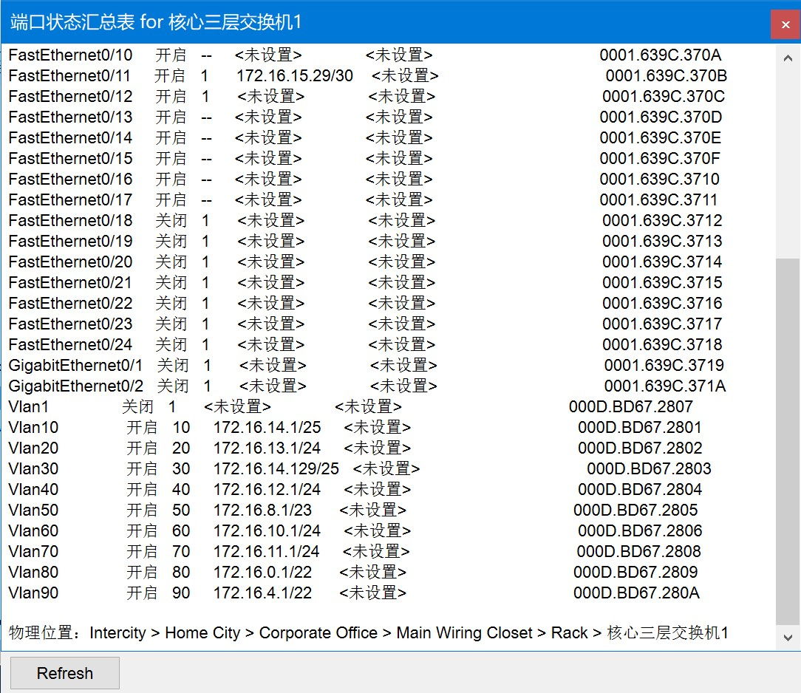
  * 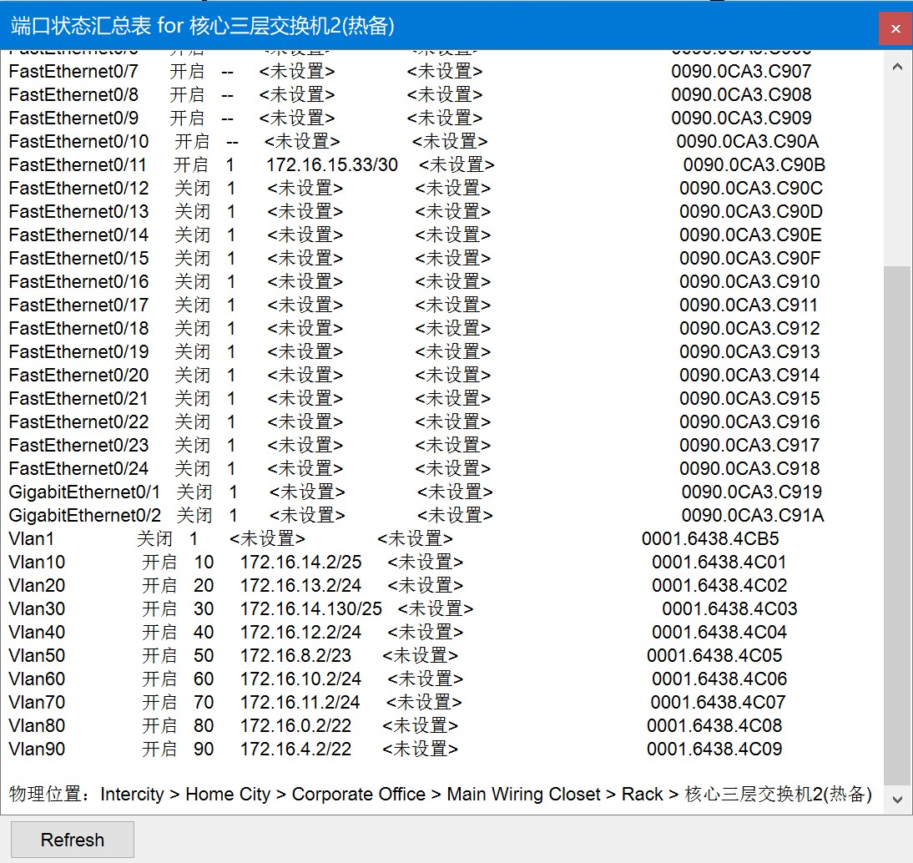

* 接下来配置各其他交换机。由于其他交换机的域内只包括一个或几个VLAN，所以其他交换机也只需要配置部分的VLAN
* 机房交换机

  ```Matlab
  Switch#conf t
  Switch(config)#vlan 10
  Switch(config-vlan)#ex
  % fastEthernet 0/4-5是上游端口，fastEthernet 0/1-3是下游端口
  Switch(config)#int range fastEthernet 0/4-5
  Switch(config-if-range)#switchport mode trunk
  Switch(config-if-range)#ex
  Switch(config)#int range fastEthernet 0/1-3
  Switch(config-if-range)#switchport mode access
  Switch(config-if-range)#switchport access vlan 10
  ```

* 行政楼交换机

  ```Matlab
  Switch#conf t
  Switch(config)#vlan 20
  Switch(config-vlan)#ex
  % fastEthernet 0/1-2是上游端口，fastEthernet 0/3-4是下游端口
  Switch(config)#int range fastEthernet 0/1-2
  Switch(config-if-range)#switchport mode trunk
  Switch(config-if-range)#ex
  Switch(config)#int range fastEthernet 0/3-4
  Switch(config-if-range)#switchport mode access
  Switch(config-if-range)#switchport access vlan 20
  ```

* 教学楼交换机

  ```Matlab
  Switch#conf t
  Switch(config)#vlan 30
  Switch(config-vlan)#ex
  % fastEthernet 0/1-2是上游端口，fastEthernet 0/3-4是下游端口
  Switch(config)#int range fastEthernet 0/1-2
  Switch(config-if-range)#switchport mode trunk
  Switch(config-if-range)#ex
  Switch(config)#int range fastEthernet 0/3-4
  Switch(config-if-range)#switchport mode access
  Switch(config-if-range)#switchport access vlan 30
  Switch(config-if-range)#end
  ```

* 图书馆交换机

  ```Matlab
  Switch#conf t
  Switch(config)#vlan 40
  Switch(config-vlan)#ex
  % fastEthernet 0/1-2是上游端口，fastEthernet 0/3-4是下游端口
  Switch(config)#int range fastEthernet 0/1-2
  Switch(config-if-range)#switchport mode trunk
  Switch(config-if-range)#ex
  Switch(config)#int range fastEthernet 0/3-4
  Switch(config-if-range)#switchport mode access
  Switch(config-if-range)#switchport access vlan 40
  ```

* 学院交换机

  ```Matlab
  SwitchDepart#conf t
  SwitchDepart(config)#vlan 50
  SwitchDepart(config-vlan)#ex
  SwitchDepart(config)#vlan 60
  SwitchDepart(config-vlan)#ex
  SwitchDepart(config)#vlan 70
  SwitchDepart(config-vlan)#ex
  % f0/1-2:上游端口
  SwitchDepart(config)#int range fastEthernet 0/1-2
  SwitchDepart(config-if-range)#switchport mode trunk
  SwitchDepart(config-if-range)#ex
  % f0/3-4属于信息学院，分配VLAN50
  SwitchDepart(config)#int range fastEthernet 0/3-4
  SwitchDepart(config-if)#switchport access vlan 50
  SwitchDepart(config-if)#ex
  % f0/5-6属于材料学院，分配VLAN60
  SwitchDepart(config)#int range fastEthernet 0/5-6
  SwitchDepart(config-if)#switchport access vlan 60
  SwitchDepart(config-if)#ex
  % f0/7-8属于数统学院，分配VLAN70
  SwitchDepart(config)#int range fastEthernet 0/7-8
  SwitchDepart(config-if)#switchport access vlan 70
  SwitchDepart(config-if)#ex
  ```

* 宿舍交换机

  ```Matlab
  SwitchDorm#conf t
  SwitchDorm(config)#vlan 80
  SwitchDorm(config-vlan)#ex
  SwitchDorm(config)#vlan 90
  SwitchDorm(config-vlan)#ex
  % f0/1-2:上游端口
  SwitchDorm(config)#int range fastEthernet 0/1-2
  SwitchDorm(config-if-range)#switchport mode trunk
  SwitchDorm(config-if-range)#ex
  % f0/3-4属于楠苑，分配VLAN80
  SwitchDorm(config)#int range fastEthernet 0/3-4
  SwitchDorm(config-if-range)#switchport access vlan 80
  SwitchDorm(config-if)#ex
  % f0/5-6属于梓苑，分配VLAN90
  SwitchDorm(config)#int range fastEthernet 0/5-6
  SwitchDorm(config-if-range)#switchport access vlan 90
  SwitchDorm(config-if)#ex
  ```

### 2. 配置相关IP地址

> 该步骤并不实现实验中的什么特定功能，但众所周知，这是网络配置中不可或缺的一步。

#### (1) 一些相关约定

* 由于之前进行了VLAN划分，现在只剩下`172.16.15.0/24`网段空闲，该网段将分配用于路由器各端口之间的通信。也正是为了节约IP，路由器端口的子网掩码均为`255.255.255.252`。(因为255.255.255.254无法提供可分配IP，所以用252)

#### (2) 指令

* 核心路由器1配置各端口IP：

  ```Matlab
  RouterCore1#conf t
  RouterCore1(config)#int f0/0
  RouterCore1(config-if)#ip address 172.16.15.2 255.255.255.252
  RouterCore1(config-if)#no shutdown
  RouterCore1(config-if)#ex

  RouterCore1(config)#int f0/1
  RouterCore1(config-if)#ip address 172.16.15.9 255.255.255.252
  RouterCore1(config-if)#no shutdown
  RouterCore1(config-if)#ex

  RouterCore1(config)#int f1/1
  RouterCore1(config-if)#ip address 172.16.15.21 255.255.255.252
  RouterCore1(config-if)#no shutdown
  RouterCore1(config-if)#ex

  RouterCore1(config)#int f1/0
  RouterCore1(config-if)#ip address 172.16.15.13 255.255.255.252
  RouterCore1(config-if)#no shutdown
  RouterCore1(config-if)#ex
  ```

* 核心路由器2配置各端口IP：

  ```Matlab
  RouterCore2(config)#int f0/0
  RouterCore2(config-if)#ip address 172.16.15.6 255.255.255.252
  RouterCore2(config-if)#no shutdown
  RouterCore2(config-if)#ex

  RouterCore2(config)#int f0/1
  RouterCore2(config-if)#ip address 172.16.15.10 255.255.255.252
  RouterCore2(config-if)#no shutdown
  RouterCore2(config-if)#ex

  RouterCore2(config)#int f1/1
  RouterCore2(config-if)#ip address 172.16.15.25 255.255.255.252
  RouterCore2(config-if)#no shutdown
  RouterCore2(config-if)#ex
  
  RouterCore2(config)#int f1/0
  RouterCore2(config-if)#ip address 172.16.15.17 255.255.255.252
  RouterCore2(config-if)#ex
  ```

* 出口路由器配置各端口IP：

  ```Matlab
  RouterOut(config)#int f0/0
  RouterOut(config-if)#ip address 172.16.15.1 255.255.255.252
  RouterOut(config-if)#no shutdown
  RouterOut(config-if)#ex

  RouterOut(config)#int f0/1
  RouterOut(config-if)#ip address 172.16.15.5 255.255.255.252
  RouterOut(config-if)#no shutdown
  RouterOut(config-if)#ex
  % 这是用于外网通信的串口
  RouterOut(config)#int s0/0/0
  RouterOut(config-if)#ip address 200.10.1.1 192.0.0.0
  RouterOut(config-if)#clock rate 64000
  RouterOut(config-if)#no shutdown
  RouterOut(config-if)#ex
  ```

  这时候应该能看到三个路由器之间的链路已经全绿了。

* 核心三层交换机1，配置连接两个核心路由器的FastEthernet端口的IP
  
  ```Matlab
  SwitchCore1(config)#int f0/1
  SwitchCore1(config-if)#no switchport
  SwitchCore1(config-if)#ip address 172.16.15.14 255.255.255.252
  SwitchCore1(config-if)#ex
  SwitchCore1(config)#int f0/2
  SwitchCore1(config-if)#no switchport
  SwitchCore1(config-if)#ip address 172.16.15.26 255.255.255.252
  SwitchCore1(config-if)#exit
  ```

* 核心三层交换机2，配置连接两个核心路由器的FastEthernet端口的IP

  ```Matlab
  SwitchCore2(config)#int f0/1
  SwitchCore2(config-if)#no switchport
  SwitchCore2(config-if)#ip address 172.16.15.18 255.255.255.252
  SwitchCore2(config-if)#ex
  SwitchCore2(config)#int f0/2
  SwitchCore2(config-if)#no switchport
  SwitchCore2(config-if)#ip address 172.16.15.22 255.255.255.252
  SwitchCore1(config-if)#exit
  ```

### 3. 链路捆绑与生成树协议

> 该步骤完成实验中的功能7和8

#### (1) 一些相关知识

* 这一部分用到了一些比较陌生的指令，比如什么`trunk encapsulation dot1q`。关于这句指令，详细内容自己去翻阅**实验指导书 实验15 单臂路由实验**，简单来说，这句指令是用于实现不同VLAN之间进行通信的。
* “最小生成树协议STP”中的STP，其实就是"Spanning-tree protocol"的缩写

#### (2) 指令

* 核心三层交换机1配置链路捆绑&&生成树：

  ```Matlab
  SwitchCore1(config)#int port-channel  1
  SwitchCore1(config-if)#switchport trunk encapsulation dot1q 
  SwitchCore1(config-if)#switchport mode trunk 
  SwitchCore1(config-if)#ex
  SwitchCore1(config)#int range fastEthernet 0/3-4
  SwitchCore1(config-if-range)#switchport trunk encapsulation dot1q
  SwitchCore1(config-if-range)#switchport mode trunk
  SwitchCore1(config-if-range)#channel-group 1 mode on
  SwitchCore1(config-if-range)#ex

  SwitchCore1(config)#spanning-tree mode pvst 
  SwitchCore1(config)#spanning-tree vlan 10,20,30,40 root primary % 设置VLAN10、VLAN20、VLAN30、VLAN40的根桥为核心交换机1
  SwitchCore1(config)#spanning-tree vlan 50,60 root secondary % 设置VLAN50、VLAN60的根桥为核心交换机2，所以这里对SwitchCore1选的是secondary
  ```

* 核心三层交换机2配置链路捆绑&&生成树：
  
  ```Matlab
  SwitchCore2(config)#int port-channel 1
  SwitchCore2(config-if)#switchport trunk encapsulation dot1q
  SwitchCore2(config-if)#switchport mode trunk
  SwitchCore2(config-if)#ex
  SwitchCore2(config)#int range fastEthernet 0/3-4
  SwitchCore2(config-if-range)#switchport trunk encapsulation dot1q
  SwitchCore2(config-if-range)#switchport mode trunk
  SwitchCore2(config-if-range)#channel-group 1 mode on
  SwitchCore2(config-if-range)#ex

  SwitchCore2(config)#spanning-tree mode pvst
  SwitchCore2(config)#spanning-tree vlan 50,60,70,80,90 root primary % 这里就把VLAN50、VLAN60的根桥设置为核心交换机2了，与SwitchCore1的设置相反
  SwitchCore2(config)#spanning-tree vlan 10,20,30,40 root secondary 
  ```

### 4. OSPF

> 该步骤完成实验中的功能3(OSPF)

#### (1) 指令

* 核心三层交换机1上设置OSPF

  ```Matlab
  SwitchCore1(config)#ip routing
  SwitchCore1(config)#router ospf 1
  SwithchCore1(config-router)#network 172.16.8.0 0.0.3.255 area 0 % 给下游的学院网段设置OSPF
  SwithchCore1(config-router)#network 172.16.15.96 0.0.0.3 area 0 % 给上游的核心路由器1网段设置OSPF
  SwithchCore1(config-router)#network 172.16.15.192 0.0.0.3 area 0 % 给上游的核心路由器2网段设置OSPF
  SwithchCore1(config-router)#ex
  ```

* 核心三层交换机2上设置OSPF

  ```Matlab
  SwitchCore2(config)#ip routing
  SwitchCore2(config)#router ospf 2
  SwitchCore2(config-router)#network 172.16.8.0 0.0.3.255 area 0
  SwitchCore2(config-router)#network 172.16.15.160 0.0.0.3 area 0
  SwitchCore2(config-router)#network 172.16.15.128 0.0.0.3 area 0
  ```

* 核心路由器1上配置OSPF

  ```Matlab
  RouterCore1(config)#router ospf 3
  % 依次4个链路的OSPF网段
  RouterCore1(config-router)#network 172.16.15.0 0.0.0.3 area 0
  RouterCore1(config-router)#network 172.16.15.64 0.0.0.3 area 0
  RouterCore1(config-router)#network 172.16.15.160 0.0.0.3 area 0
  RouterCore1(config-router)#network 172.16.15.96 0.0.0.3 area 0
  ```

* 核心路由器2上配置OSPF

  ```Matlab
  RouterCore2(config)#router ospf 4
  RouterCore2(config-router)#network 172.16.15.32 0.0.0.3 area 0
  RouterCore2(config-router)#network 172.16.15.64 0.0.0.3 area 0
  RouterCore2(config-router)#network 172.16.15.192 0.0.0.3 area 0
  RouterCore2(config-router)#network 172.16.15.128 0.0.0.3 area 0
  ```

* 出口路由器上配置OSPF

  ```Matlab
  RouterOut(config)#router ospf 5
  RouterOut(config-router)#network 172.16.15.0 0.0.0.3 area 0
  RouterOut(config-router)#network 172.16.15.32 0.0.0.3 area 0
  ```

### 5. NAT与静态路由

> 该步骤完成实验中的功能5和3(静态路由)

#### (1) 指令

* ISP路由器基本配置

  ```Matlab
  RouterISP(config)#int serial 0/0/0
  RouterISP(config-if)#ip address 200.10.1.2 255.255.255.240
  RouterISP(config-if)#no shutdown 

  RouterISP(config-if)#int f0/0
  RouterISP(config-if)#ip address 100.10.1.1 255.255.255.240
  RouterISP(config-if)#no shutdown 
  ```

* 互联网服务器基本配置
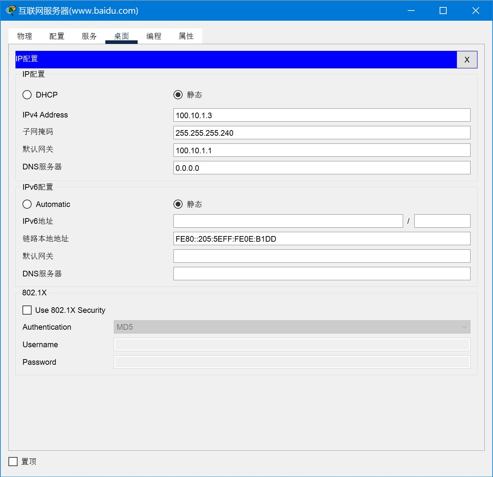

* 互联网用户基本配置
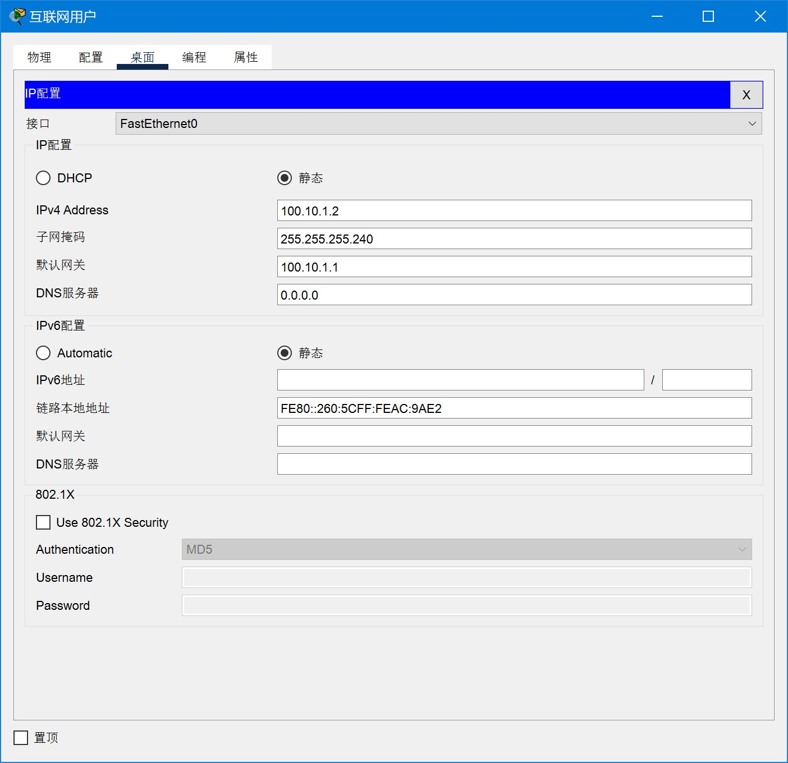

* 出口路由器配置NAT和静态路由

  ```Matlab
  RouterOut#conf t
  RouterOut(config)#int range fastEthernet 0/0-1 % 选中f0/1和f0/2，设为NAT的内部部分
  RouterOut(config-if-range)#ip nat inside
  RouterOut(config-if-range)#ex
  RouterOut(config)#int serial 0/0/0 % 选中S0/0/0，设为NAT的外部部分
  RouterOut(config-if)#ip nat outside 
  RouterOut(config-if)#ex
  RouterOut(config)#ip route 0.0.0.0 0.0.0.0 200.10.1.2 % 前两段分别是IP和掩码，意思是将来自任意IP、任意掩码的数据报都路由到200.10.1.2，也就是ISP路由器上
  RouterOut(config)#router ospf 5 % 选中之前给出口路由器划的OSPF
  RouterOut(config-router)#default-information originate % 设定当前路由为缺省路由
  RouterOut(config-router)#ex
  RouterOut(config)#ip nat pool DZC 200.10.1.3 200.10.1.6 netmask 255.255.255.240 % 设置一个NAT的地址池（其实我也不知道这是干嘛的）
  RouterOut(config)#access-list 1 permit 172.16.0.0 0.0.15.255 % 172.16.0.0是网段号，后面这个是掩码，这两个合起来就是给定的整个校园网的网段。这里是将整个校园网的网段都划入了允许接入的IP范围内，也就是允许通过它接入外网
  RouterOut(config)#ip nat inside source list 1 pool DZC % 将上面的access-list 1关联到地址池上
  ```

* 此时应该就能够使用校园网内任意一台主机ping到互联网服务器了，至此NAT和静态路由就配置结束了。
* 此时可以在出口路由器主界面(没有config的)输入`show ip nat translations`，可以看到出口路由器的视角下的`Protocol`、`Inside global`、`Inside local`、`Outside local`四列IP信息，挺有意思的。

### 6. 校园网、DNS、邮箱服务

> 该步骤完成实验中的功能10
>
> 这一步可很有意思啊

#### (1) 一些相关知识

* Http：超文本传输协议，大致意思是传输过程中内容的实质是文本，但是显示出来的可以是各种内容，所以是“超文本”
* DNS：域名解析服务，部署该服务的服务器可以接收域名请求，并将接收的域名解析为IP地址，它起到的功能就是不用去记毫无规律的IP地址而是有特定含义的域名了。但这一功能也可以用于建立“墙”
* POP3和SMTP服务：自己手动配置过邮箱服务的肯定不陌生，邮箱服务器通常会区分这两个域名(可能还有个IMAP)，以应对不同等级的邮箱服务需求。

#### (2) Http服务器的相关配置

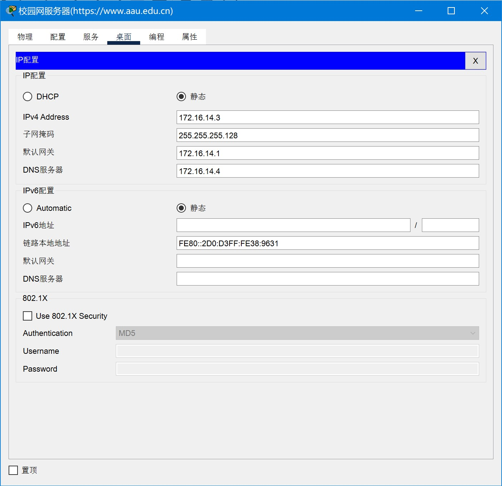
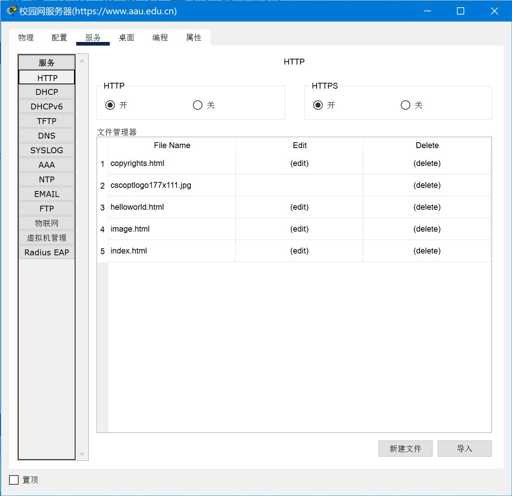

* 可以修改一下这台服务器的HTML页面的信息(虽然这个作业没要求)，点index.html旁边的`(edit)`即可开始编辑。这个文件的内容就是一个不能再简单的HTML页面，一般将第3行中的提示自行修改即可，注意不要用中文，修改完后记得保存。
* 互联网服务器的也可以改改

#### (3) DNS服务器的相关配置

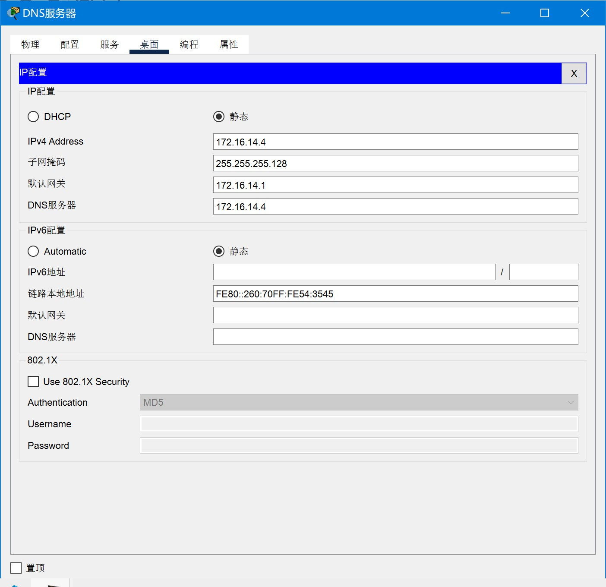
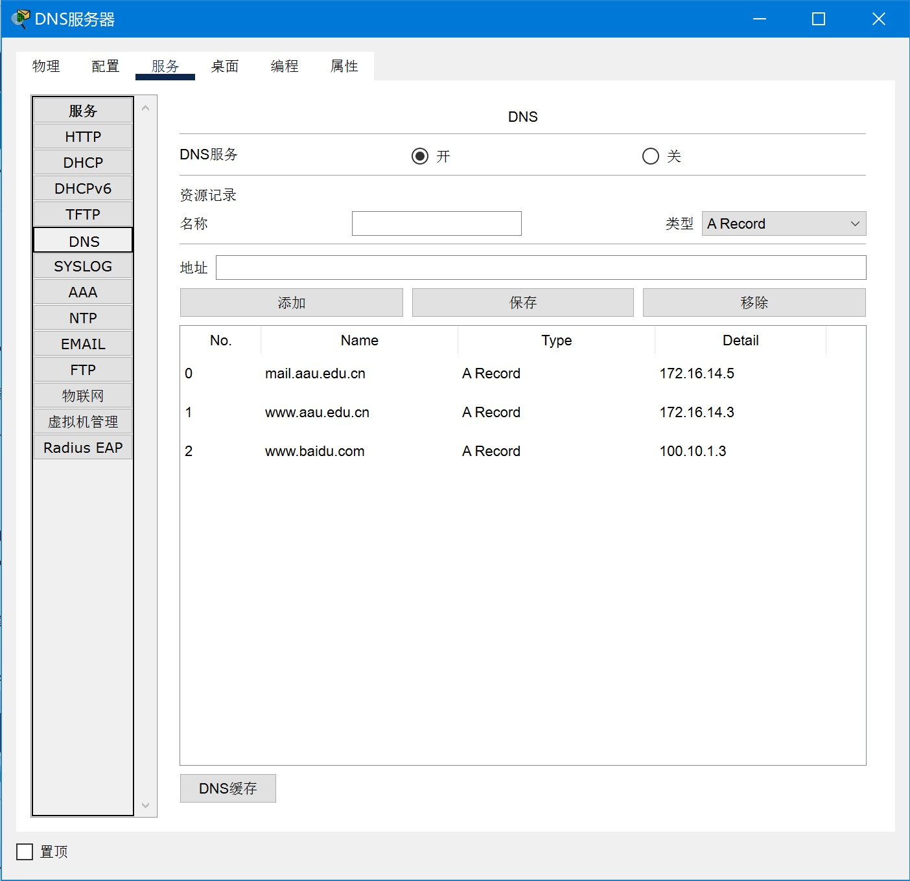

* 添加上图的3条DNS记录，类型就保持默认的A Record(A记录)即可。那个`mail.aau.edu.cn`就是邮箱服务的域名。
* 现在在校园网中任意一台主机，使用Desktop(桌面)-Web Browser(网络浏览器)就可以通过输入网址的方式访问学校官网和百度了，在此过程中请保持耐心....我访问的时候加载就很慢，大概需要接近一分钟才能加载出来，可能是因为我的电脑性能有些低了吧

#### (4) 电子邮件服务器的相关配置

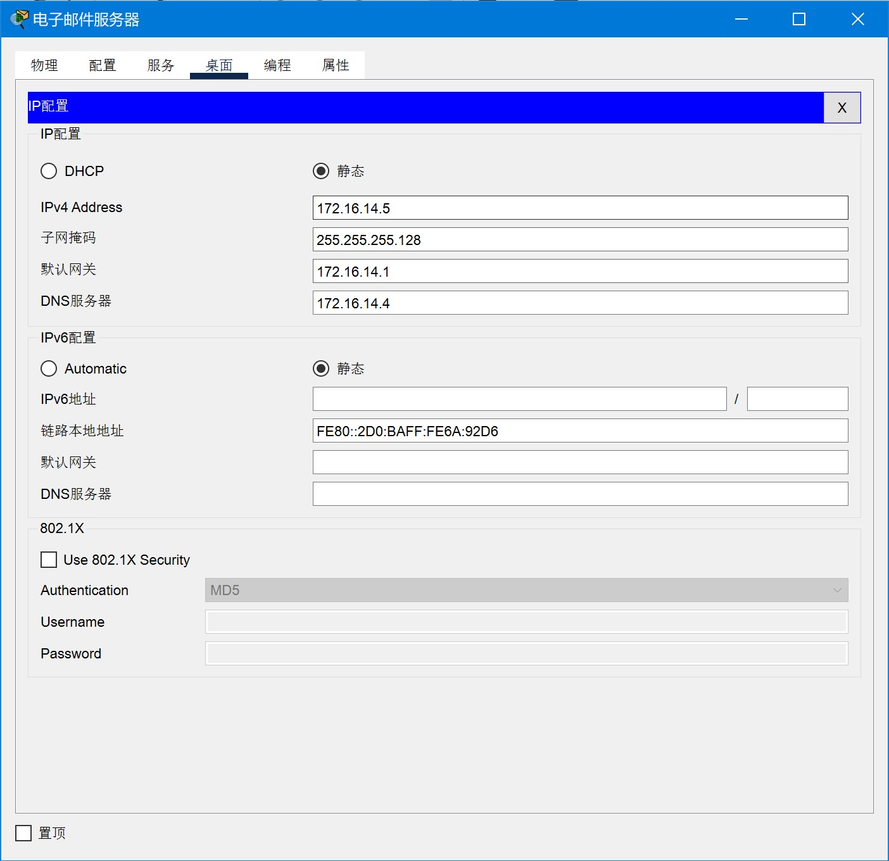
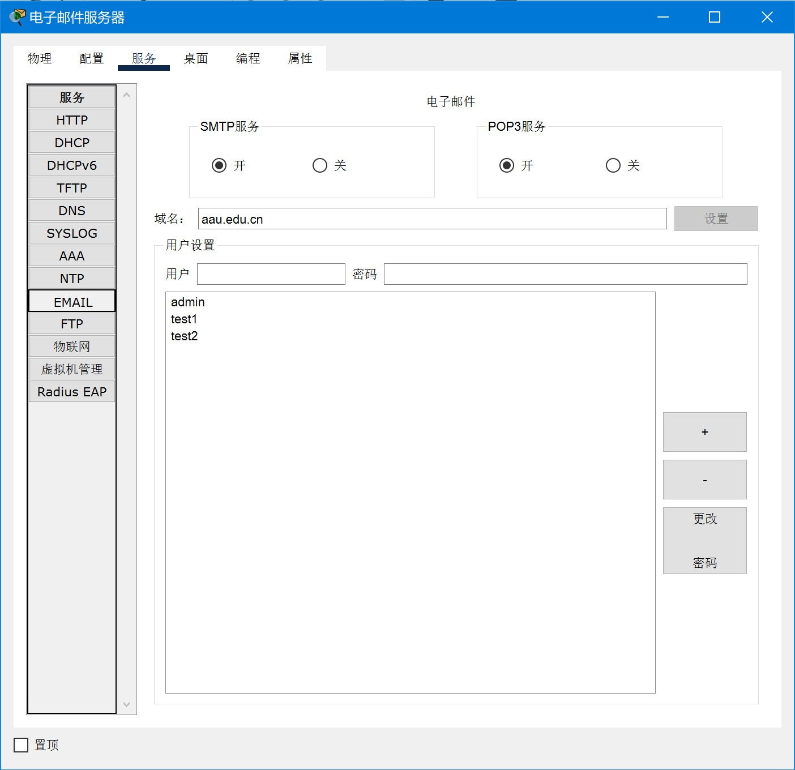

* 注意将SMTP和POP3都打开
* 域名(domain name)填"aau.edu.cn"，然后点右边的"设置"(Set)
* 然后在下边添加几个用户，用户名密码自定即可。（比如说我这里就叫test1、test2和admin）

* 现在就可以收发邮件了，操作方式如下：
  1. 任意点开两个主机，前提是网络已配置好。
  2. 都点开Desktop(桌面)-Email(电子邮件)
  3. 初次点开要进行配置：
     * Your Name(您的名字)：任意填
     * Email Address(电子邮件地址)：格式为之前在服务器上创建的用户名，后跟`@aau.edu.cn`
     * Incoming Mail Server(接收邮件服务器)和Outgoing Mail Server(发送邮件服务器)都填`mail.aau.edu.cn`
     * User Name(用户名)和Password(密码)填在Email服务器上设置的用户名和密码
  4. 配置完成后点Save即可保存设置，然后你就进入邮件程序主页。
  5. 点击`Compose(写邮件)`即可发信，剩下的步骤就和咱们常用的电子邮件一样了。

### 7. 配置无线网络

> 该步骤完成实验中的功能4

#### (1) 指令配置

> 目的是能让无线路由器与校园网内进行通信

* 核心三层交换机1上配置OSPF

  ```Matlab
  SwithchCore1(config)#int FastEthernet0/11
  SwithchCore1(config)#no switchport
  SwithchCore1(config-if)#ip address 172.16.15.29 255.255.255.252
  SwitchCore1(config-if)#ex
  SwithchCore1(config)#router ospf 1
  SwithchCore1(config-router)#network 172.16.15.29 0.0.0.3 area 0
  ```

* 核心三层交换机2上配置OSPF

  ```Matlab
  SwitchCore2(config)#interface FastEthernet0/11
  SwitchCore2(config-if)#no switchport
  SwitchCore2(config-if)#ip address 172.16.15.33 255.255.255.252
  SwitchCore2(config-if)#ex
  SwitchCore2(config)#router ospf 2
  SwitchCore2(config-router)#network 172.16.15.33 0.0.0.3 area 0
  ```

* 无线(用)路由器上配置各端口IP

> 这是那个牵出来，给WiFi设备用的那个常规路由器，不是有俩天线的那个

  ```Matlab
  Router(config)#int f1/0
  Router(config-if)#ip address 172.16.15.30 255.255.255.252
  Router(config-if)#no shutdown
  Router(config-if)#ex
  Router(config)#int f1/1
  Router(config-if)#ip address 172.16.15.34 255.255.255.252
  Router(config-if)#no shutdown
  Router(config-if)#ex
  Router(config)#int f0/0
  Router(config-if)#ip address 172.16.15.37 255.255.255.252
  Router(config-if)#no shutdown
  Router(config-if)#ex
  % 在路由器上配置OSPF
  Router(config)#ip routing
  Router(config)#router ospf 6 % 将与之相连的三个IP都划到OSPF域中
  Router(config-router)#network 172.16.15.37 0.0.0.3 area 0
  Router(config-router)#network 172.16.15.34 0.0.0.3 area 0
  Router(config-router)#network 172.16.15.30 0.0.0.3 area 0
  ```

#### (2) 配置无线路由器("WiFi路由器(DHCP)"那个)

> 这个相对来说麻烦一点，涉及到Setting和GUI两个标签页的配置。

1. GUI-Setup-Basic Setup-互联网设置
   * IP地址为172.16.15.38;
   * 子网掩码255.255.255.252;
   * 默认网关172.16.15.37(填上游路由器的IP,很合理);
   * DNS服务器填172.16.14.4(全校共用这一台DNS服务器)
2. GUI-Setup-Basic Setup-网络设置
   * 先打开DHCP服务,起始IP地址可以用192.168.0.2开始,最大用户数量写253(最大值)
   * 静态DNS1填172.16.14.4
3. <font color=Red>搞完这些记得把页面拉到最下面，保存修改。</font>完成后的效果如下图
   * 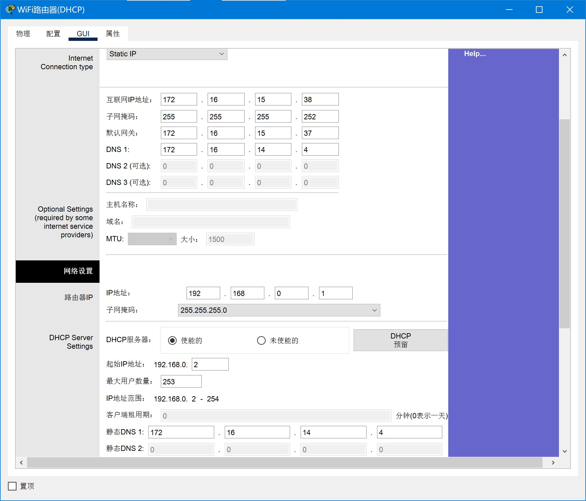
4. $PS$：`GUI-Wireless`里,`Basic Wireless Settings`可以修改WiFi名称(SSID)，`Wireless Security`可以给WiFi添加密码,但是在本实验中没啥用，只是徒增麻烦，我就没改。
5. 你应该已经注意到了，刚刚GUI里子网掩码只能填到`255.255.255.0`，而要求却是能分配1024个IP，所以我们需要进行进一步的修改
   * 点开`Settings(设置)-WAN(互联网)`,这里的配置请和刚刚的网络设置区域保持一致
   * 点开`Settings(设置)-LAN`，IPv4 Address填`192.168.0.1`(局域网网关);子网掩码填`255.255.252.0`(这样才能分配1024个内网IP)
   * 这个页面没有保存按钮，直接关掉即可.退出后可以将鼠标悬浮在无线路由器上查看配置信息，如果LAN显示为`(网关IP)/22`，说明配置成功，如下图所示。
   * 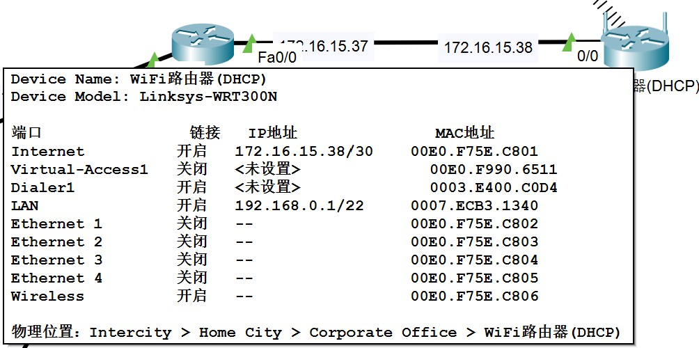

#### (3) 配置PC

* 这个就很简单了，先连接上WiFi(没密码好像会自动连上,会有一个虚线表示)
* 然后点开`PC-Desktop(桌面)-IP config`。先切换到Static(静态)，然后切换到DHCP，这么做的目的是让PC重新请求DHCP，相当于刷新，等一会就能看到这些空都被自动填上了，就是DHCP分配成功。
  * 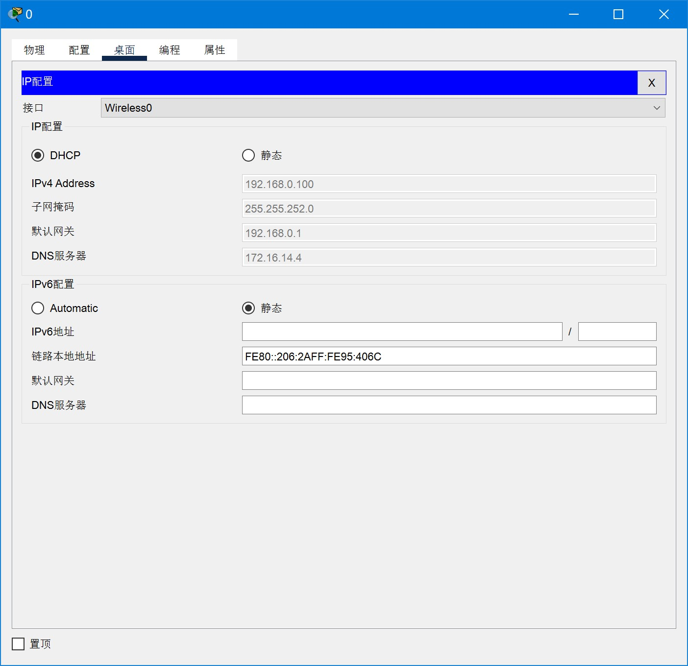
* 此时即可用该PC的Web Browser访问校园网了，这表示全部配置完成。
* 如果手机或电脑没有自动连接上，请点开设备，`Config-Wireless0`那里，自行将SSID改为你的WiFi的SSID(连WiFi居然要手动输入SSID，没有扫描功能....这有点太逊了)，这俩设备一般DHCP都是开着的，连上自动就分配。

### 8. VPN配置

> 该步骤完成实验中的功能6
>
> <font color=Red>但是我的配置过程失败了....这里的操作实际上都没有执行，之后会提原因的</font>

    此时你在互联网用户（外网用户）那里ping学校官网或者图书馆的一台主机，会发现在100.10.1.1（ISP路由器）那里就被拒绝了，提示`Destination host unreachable`。因为官网服务器和图书馆主机都是架设在校园网内的，而我们之前又在出口路由器上配置了access-list，你的IP不在这个范围内，自然不允许接入了。
    此时就需要使用VPN服务了

#### (1) ISP路由器

* 配置ISAKMP策略

  ```Matlab
  RouterISP#conf t
  RouterISP(config)#crypto isakmp policy 1
  RouterISP(config-isakmp)#encryption aes
  RouterISP(config-isakmp)#hash sha
  RouterISP(config-isakmp)#authentication pre-share
  RouterISP(config-isakmp)#group 2
  RouterISP(config-isakmp)#crypto isakmp key aau address 200.10.1.1 % 密码为aac，对端IP即为出口路由的外部IP
  ```

* 配置ACL

  ```Matlab
  RouterISP(config)#access-list 100 permit ip 100.10.1.0 0.0.0.15 172.16.0.0 0.0.15.255 % 接收端的内部网段
  ```

* 配置ipsec策略集

  > 这里出现问题。yf-set后面只能跟一个加密算法参数，而所有相关资料中都使用了两个加密算法，我尝试过只写一个往下进行，结果加密算法协商时就失败了，无法完成。

  ```Matlab
  RouterISP(config)#crypto ipsec transform-set yf-set esp-aes
  ```

* 配置加密映射集

  ```Matlab
  RouterISP(config)#crypto map yf-map 1 ipsec-isakmp
  RouterISP(config-crypto-map)#set peer 200.10.1.1 % 这里填的是对端路由器的外部IP
  RouterISP(config-crypto-map)#set transform-set yf-set
  RouterISP(config-crypto-map)#match address 100 % 刚刚设置的access-list编号为100，所以这里就是100
  RouterISP(config-crypto-map)#ex
  ```

* 将yf-map应用到端口

  ```Matlab
  RouterISP(config)#int s0/0/0
  RouterISP(config-if)#crypto map yf-map
  RouterISP(config-if)#ex
  ```

#### (2) 出口路由器

> 大体步骤和ISP路由器是类似的

* 配置ISAKMP策略

  ```Matlab
  RouterOut(config)#crypto isakmp policy 1
  RouterOut(config-isakmp)#encryption aes
  RouterOut(config-isakmp)#hash sha
  RouterOut(config-isakmp)#authentication pre-share
  RouterOut(config-isakmp)#group 2
  RouterOut(config-isakmp)#crypto isakmp key aac address 200.10.1.2
  ```

* 配置ACL

  ```Matlab
  RouterOut(config)#access-list 100 permit ip 172.16.0.0 0.0.15.255 100.10.1.0 0.0.0.15 % 其实就是把上一个的IP对调一下
  ```

* 配置ipsec策略(转换集)
  > 同样的错误，无法解决

  ```Matlab
  RouterOut(config)#crypto ipsec transform-set yf-set esp-aes
  ```

* 配置加密映射集

  ```Matlab
  RouterOut(config)#crypto map yf-map 1 ipsec-isakmp
  RouterOut(config-crypto-map)#set peer 200.10.1.2
  RouterOut(config-crypto-map)#set transform-set yf-set
  RouterOut(config-crypto-map)#match address 100
  RouterOut(config-crypto-map)#ex
  ```

* 将yf-map应用到端口

  ```Matlab
  RouterOut(config)#int s0/0/0
  RouterOut(config-if)#crypto map yf-map
  ```

#### (3) 本部分的后记

* 猜测可能又是版本问题导致的配置无法进行下去....这是一个思科的很严重的问题，因为哪怕只旧1版的实验指导书，其中的许多指令格式也会出问题。
* 然后这又正巧是VPN嘛，一个国内几乎不允许被提起的技术，所以网上能找到的参考文献和教程寥寥无几，官方文档好像在它的Academic网站里，而这个网站国内又时常登不进去，且文档没做汉化....
* 我曾尝试过问老师，但是他只甩给我一份我已经仔细看过的博客....看来老师大概也没亲自做这份实验(这是可以说的吗？)
* 所以最后我选择用造个假的截图甩上去，反正他也不收源文件....好学生不要学我哦。
* 我找到的所有相关的文章就放到这了，欢迎自取并继续研究。
  * [通过思科模拟器CISCO PACKET TRACER学习网络——VPN - 知乎](https://zhuanlan.zhihu.com/p/490367377)
  * [【实战演练】Packet Tracer玩转CCNA实验18-IPSec VPN - 知乎](https://zhuanlan.zhihu.com/p/104968403)
  * [Ipsec配置 - 简书](https://www.jianshu.com/p/22fb489ee450)

### 9. 配置额外的ACL访问控制

> 该步骤完成实验中的功能9

    实验指导书上没说的是，划分了VLAN后，配置ACL要在对应的VLAN中进行....我直接用int range f0/X指令进行的总是不行，耽误我很长时间。

#### (1) 宿舍不能访问行政楼和教学楼

> 要在两个核心三层交换机上分别配置两个ACL规则。（因为现在两个核心三层交换机相互热备，一个连不到可以换另一个，所以要在两个三层交换机上都配置ACL规则）

* 核心三层交换机1

  ```Matlab
  SwithchCore1(config)#access-list 10 deny 172.0.0.1 0.0.7.255 % 拒绝来自宿舍网段的数据报
  SwithchCore1(config)#int vlan 20 % vlan 20是行政楼
  SwithchCore1(config-if)#ip access-group 10 out % out指的是在转发出数据报时应用这条规则
  SwithchCore1(config-if)#int vlan 30 % vlan 30是教学楼
  SwithchCore1(config-if)#ip access-group 10 out
  SwithchCore1(config-if)#end
  ```

* 核心三层交换机2

  ```Matlab
  SwitchCore2(Config)#access-list 20 deny 172.0.0.1 0.0.7.255 % 同样拒绝来自宿舍网段的数据报
  SwitchCore2(config)#int vlan 20
  SwitchCore2(config-if)#ip access-group 20 out
  SwitchCore2(config-if)#int vlan 30
  SwitchCore2(config-if)#ip access-group 20 out
  SwitchCore2(config-if)#end
  ```

* 此时再去用宿舍的主机去ping行政楼或教学楼的主机，应当都由核心三层交换机2上，宿舍所在的VLAN网关提示`Destination host unreachable.`了。

#### (2) 外网不能访问教学楼资源

> 翻译一下也就是“内网且非宿舍网段才能访问教学楼资源”。这段地址就是172.16.8.0~172.16.15.255，网段记为`172.16.8.1 0.0.7.255`，只允许这个网段访问即可。

* 核心三层交换机1
  
  ```Matlab
  SwithchCore1(config)#access-list 30 permit 172.16.8.1 0.0.7.255
  SwithchCore1(config)#int vlan 30
  SwithchCore1(config-if)#ip access-group 30 out
  SwithchCore1(config-if)#end
  ```

* 核心三层交换机2

  ```Matlab
  SwitchCore2(config)#access-list 40 permit 172.16.8.1 0.0.7.255
  SwitchCore2(config)#int vlan 30
  SwitchCore2(config-if)#ip access-group 40 out
  SwitchCore2(config-if)#end
  ```

## 🎂恭喜你，你已经完成了基础需求，其实你现在就可以开开心心地截图写报告然后把作业交给甲方了。不过如果你仍然想完成剩下的两个附加配置，我也不拦着

## 五、附加需求配置

### Extra 1: IP电话

> 该步骤完成实验中的附加功能1

#### (1) 行政楼IP电话配置

* 将一个路由器和两个IP电话连接在核心三层交换机1上，记好都连的哪些端口
* 别忘了给IP电话插电源，电源默认是关着的
* 交换机上给路由器的接口设置为trunk模式，这一步直接使用GUI解决吧。
  * 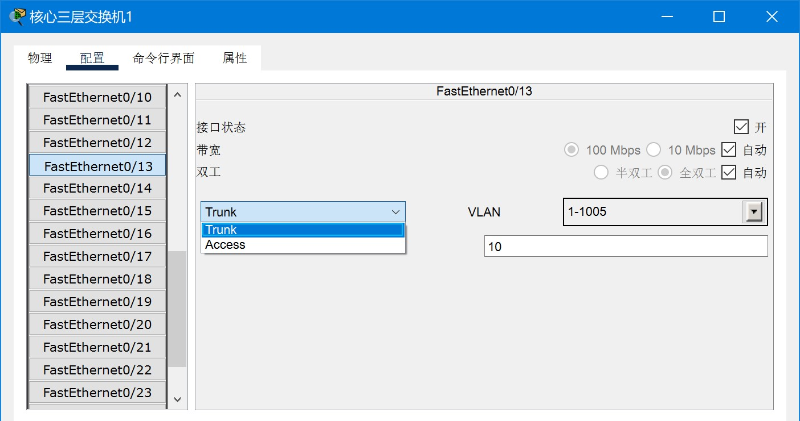
* 路由器上，把对应的接口打开
  * 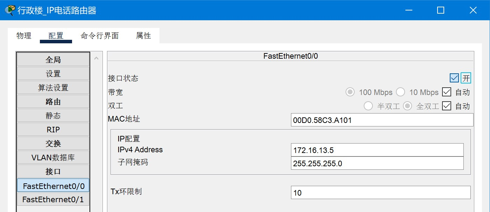

* 行政楼IP电话的路由器上的配置

  ```Matlab
  RouterAdministration(config)#ip dhcp pool ip-phone
  RouterAdministration(dhcp-config)#network 172.16.13.0 255.255.255.0
  RouterAdministration(dhcp-config)#default-router 172.16.13.5
  RouterAdministration(dhcp-config)#option 150 ip 172.16.13.5
  % 配置f0/0的IP，这个端口连的是交换机
  RouterAdministration(dhcp-config)#int f0/0
  RouterAdministration(config-if)#ip address 172.16.13.5 255.255.255.0
  RouterAdministration(config-if)#duplex auto
  RouterAdministration(config-if)#speed auto
  % 不开启f0/1
  RouterAdministration(config-if)#int f0/1
  RouterAdministration(config-if)#no ip address 
  RouterAdministration(config-if)#duplex auto
  RouterAdministration(config-if)#speed auto
  RouterAdministration(config-if)#shutdown
  % 创建Vlan1(但其实一般Vlan1都默认存在的)
  RouterAdministration(config-if)#int Vlan1
  RouterAdministration(config-if)#no ip address 
  RouterAdministration(config-if)#shutdown
  % 配置IP电话相关服务
  RouterAdministration(config-if)#telephony-service
  RouterAdministration(config-telephony)#max-ephones 5
  RouterAdministration(config-telephony)#max-dn 5
  RouterAdministration(config-telephony)#ip source-address 172.16.13.5 port 2000
  RouterAdministration(config-telephony)#auto assign 1 to 5
  % 分配电话号码
  RouterAdministration(config-telephony)#ephone-dn 1
  RouterAdministration(config-ephone-dn)#number 94202314
  RouterAdministration(config-ephone-dn)#ephone-dn 2
  RouterAdministration(config-ephone-dn)#number 94202315
  ```

* 核心三层交换机1上相关的配置

  ```Matlab
  SwithchCore1(config)#int f0/13 % f0/13和f0/14都是IP电话连的端口
  SwithchCore1(config-if)#switchport trunk encapsulation dot1q
  SwithchCore1(config-if)#switchport mode trunk
  SwithchCore1(config-if)#switchport voice vlan 1 % 这里大概是将vlan 1设置成了IP电话专用vlan

  SwithchCore1(config-if)#int f0/14
  SwithchCore1(config-if)#switchport trunk encapsulation dot1q
  SwithchCore1(config-if)#switchport mode trunk
  SwithchCore1(config-if)#switchport voice vlan 1
  SwithchCore1(config-if)#ex
  ```

* 随后要耐心等一小段时间，大概1分钟，直到鼠标悬浮在IP电话上时能看到Vlan1的IP地址和Line Number都不为空，说明DHCP自动配置完成。
* 如何测试效果呢：在IP电话的GUI页面里面可以拨号，同时打开两台IP电话，在一台电话上拨打另一台电话的号码，如果另一台也振铃了，说明配置完成。

#### (2) 学院IP电话配置

> 过程是完全一样的，这里就只放命令了。

* 学院IP电话的路由器上的配置

  ```Matlab
  RouterDepart(config)#ip dhcp pool ip-phone
  RouterDepart(dhcp-config)#network 172.16.8.0 255.255.252.0
  RouterDepart(dhcp-config)#default-router 172.16.8.5
  RouterDepart(dhcp-config)#option 150 ip 172.16.8.5

  RouterDepart(dhcp-config)#int f0/0
  RouterDepart(config-if)#ip address 172.16.8.5 255.255.252.0
  RouterDepart(config-if)#duplex auto
  RouterDepart(config-if)#speed auto

  RouterDepart(config-if)#int f0/1
  RouterDepart(config-if)#no ip address
  RouterDepart(config-if)#duplex auto
  RouterDepart(config-if)#speed auto
  RouterDepart(config-if)#shutdown
  RouterDepart(config-if)#int Vlan1
  RouterDepart(config-if)#no ip address
  RouterDepart(config-if)#shutdown

  RouterDepart(config-if)#telephony-service
  RouterDepart(config-telephony)#max-ephones 5
  RouterDepart(config-telephony)#max-dn 5
  RouterDepart(config-telephony)#ip source-address 172.16.8.5 port 2000
  RouterDepart(config-telephony)#auto assign 1 to 5
  RouterDepart(config-telephony)#ephone-dn 1
  RouterDepart(config-ephone-dn)#number 94202316
  RouterDepart(config-ephone-dn)#ephone-dn 2
  RouterDepart(config-ephone-dn)#number 94202317
  ```

* 核心三层交换机1上相关的配置

  ```Matlab
  SwithchCore1(config)#int f0/16
  SwithchCore1(config-if)#switchport trunk encapsulation dot1q
  SwithchCore1(config-if)#switchport mode trunk
  SwithchCore1(config-if)#switchport voice vlan 1

  SwithchCore1(config-if)#int f0/17
  SwithchCore1(config-if)#switchport trunk encapsulation dot1q
  SwithchCore1(config-if)#switchport mode trunk
  SwithchCore1(config-if)#switchport voice vlan 1
  SwithchCore1(config-if)#ex
  ```

* 同样也是稍等一会就能看到配置完成了
* 不过测试了一下，学院的没法打到行政楼....就其实没有那么好玩

### Extra 2:防火墙

> 防火墙就是在原本内外网之间畅行无阻的链路上，手动添加一层过滤机制。鉴于之前已经完成了绝大多数配置了，所以这里强烈建议，在链路上添加防火墙时，不要改变先前接口的位置。

#### (1) 指令

* 在核心路由器1和出口路由器之间插入防火墙1并配置

  ```Matlab
  Firewall1>
  Firewall1>en
  Password: % 这里会提示输入密码，直接回车忽略即可
  Firewall1#conf t
  Firewall1(config)#enable password aau % 设置个密码，aau
  % 以下这些设置完全不用改，直接照抄即可
  Firewall1(config)#int vlan 1 % 内网的一些设置
  Firewall1(config-if)#nameif inside
  Firewall1(config-if)#ip address 192.168.1.1 255.255.255.0
  Firewall1(config-if)#Security-level 100

  Firewall1(config-if)#int vlan 2 % 外网的一些设置
  Firewall1(config-if)#nameif outside
  Firewall1(config-if)#ip address 192.168.10.100
  Firewall1(config-if)#Security-level 0
  Firewall1(config-if)#exit
  % 这里注意一下，我进入的是e0/1，自行确认好你的防火墙哪一个接口接的是外网
  Firewall1(config)#int e0/1
  Firewall1(config-if)#switchport access vlan 2 % 将刚刚给外网配置的vlan分配到外网的物理端口上
  Firewall1(config-if)#no shutdown
  Firewall1(config-if)#switchport mode access
  ```

  * 好了这就配完一个了，还挺快的。
* 然后咱不是双路由热备嘛，两台核心路由器都可以向外转发，所以需要在两条链路上各放一台防火墙。
* 核心路由器2和出口路由器之间插入防火墙2并配置

  ```Matlab
  Firewall2>
  Firewall2>en
  Password:
  Firewall2#conf t
  Firewall2(config)#enable password aau

  Firewall2(config)#int vlan 1
  Firewall2(config-if)#nameif inside
  Firewall2(config-if)#ip address 192.168.1.1 255.255.255.0
  Firewall2(config-if)#Security-level 100

  Firewall2(config-if)#int vlan 2
  Firewall2(config-if)#ip address 192.168.10.100
  Firewall2(config-if)#Security-level 0
  Firewall2(config-if)#exit

  Firewall2(config)#int e0/1
  Firewall2(config-if)#switchport access vlan 2
  Firewall2(config-if)#no shutdown
  Firewall2(config-if)#switchport mode access
  ```

* 防火墙这就配完了（大概是认为防火墙本身就自带了好多过滤规则吧，所以配置上只要将其连起来就行起来很简单）
* 这时候只要测试一下，仍能从内网连接到外网的百度即说明你的防火墙没有导致出口链路中断，配置成功。

## 六、References

* 计算机网络实验指导书 / 郭雅，李泗兰主编，—北京：电子工业出版社，2022.1 ISBN 978-7-121-42455-7
* [思科模拟器 Packet Tracer 校园网搭建——从零到有详细教学_哔哩哔哩_bilibili](https://www.bilibili.com/video/BV1kY411w73v)
* [Cisco PT 软件模拟实现双核心中型企业/校园网_哔哩哔哩_bilibili](https://www.bilibili.com/video/BV1oY4y1G7Qu)
* [通过思科模拟器CISCO PACKET TRACER学习网络——VPN - 知乎](https://zhuanlan.zhihu.com/p/490367377)
* [【实战演练】Packet Tracer玩转CCNA实验18-IPSec VPN - 知乎](https://zhuanlan.zhihu.com/p/104968403)
* [Ipsec配置 - 简书](https://www.jianshu.com/p/22fb489ee450)
* [Cisco Packet Tracert 邮件服务器配置_雨山yscy的博客](https://blog.csdn.net/yushan_caoyu/article/details/128011126)
