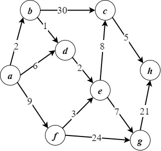

# 《运筹学》课程的相关资料

> 这是上学期《最优化理论》课程的进阶课程，相较于上学期主要研究组合优化，这学期更多研究决策规划。
>
> 此外还是一门典型的人工智能的先修课，记得好好听课

## 使用环境

* Windows 10
* Matlab R2022a
* Python 3.9.7
* Microsoft Word（用于写实验报告）

## 教材

* 《运筹学基础及应用（第七版）》，胡运权 等著，高等教育出版社

## 目录

### [实验1：单纯形法(Simplex Method)](./实验1/)

* 代码：[`单纯形法.py`](./实验1/单纯形法.py)
* 测试用例：[`线性规划_demo.md`](./实验1/线性规划_demo.md)
* 实验报告：[Report.pdf](./实验1/Report.pdf)

### [实验2：对偶问题与对偶单纯形法(Dual simplex method)](./实验2/)

* 代码
  * 功能函数：[`DualSimplexAlgorithm.m`](./实验2/DualSimplexAlgorithm.m)
  * 入口函数：[`script.m`](./实验2/script.m)
* 测试用例：[`demo.md`](./实验2/demo.md)
* 实验报告：[Report.pdf](./实验2/Report.pdf)

### [实验3：分支定界法(Branch and bound method)](./实验3/)

* 代码：[`Branch.mlx`](./实验3/Branch.mlx)
  * 这是Matlab即时编辑器文件，请使用Matlab打开
* 实验报告：[Report.pdf](./实验3/Report.pdf)

### [实验4：Dijkstra算法](./实验4/)

* 代码:[`Dijkstra.py](./实验4/Dijkstra.py)
* 测试用例：[`demo.drawio`](./实验4/demo.drawio)

* 实验报告：[Report.docx](./实验4/Report.docx)
